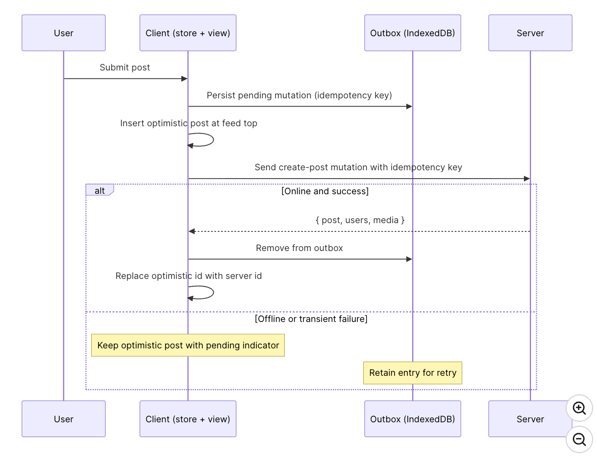

## [News Feed](https://www.greatfrontend.com/interviews/study/gfe75/questions/system-design/news-feed-facebook)

### Requirements

#### What are the core features to be supported?

1. Creating and publishing new posts
2. Browse feeds of user and their friends
3. Liking and Reacting to posts

#### What kind of posts are supported?

Primarily text and image-based posts.

#### What pagination UX should be used for the feed?

Infinite scrolling, meaning more posts will be added when the user reaches the end of their feed. For long-lived sessions, it is also worth discussing how newer posts are surfaced at the top without silently disrupting what the user is reading.

#### Will the application be used on mobile devices?

Not a priority, but a good mobile experience would be nice. The architecture discussion can stay web-first unless the interviewer explicitly wants to focus on mobile-specific interaction patterns.

---

### Architecture / High-Level Design

A well-structured front-end architecture separates concerns across distinct layers, each responsible for a specific set of tasks.

#### Rendering Approach

1. **CSR (Client-Side Rendering)**
2. **SSR (Server-Side Rendering)**
3. **Hybrid**

For a personalized signed-in feed, the main benefit of rendering on the server is performance, not SEO. The content is already personalized, so search indexing is much less important than keeping the session interactive and responsive.

That makes **CSR** the best default answer for the home feed. The feed is highly interactive, heavily personalized, and benefits from keeping state alive in the browser over a long-lived session. This is a long-session state-management tradeoff, not a claim that CSR has the fastest cold start.

#### Navigation Approach

1. **Single-Page Application (SPA)**: The app loads once, then uses JavaScript to update the URL, fetch data, and update the DOM without a full page reload.
2. **Multi-Page Application (MPA)**: Each route is a separate HTML page, and navigation triggers a full page reload.
3. **Recommendation**: For a feed product, SPA is the stronger default. The biggest reason is shared client state. Most users open a post from the feed itself. In an SPA, the main post details such as text, media, and author data may already be in the store, so navigation to the post detail page can feel nearly instant, and only replies or comments need to be fetched after navigation.

_In an MPA, navigation tears down the current page state and rebuilds it from scratch._

#### Architecture Layers


- **View Layer**: The direct interface for user interaction (e.g., feed pages, post details, and composers). This layer is responsible for rendering data provided by the Store and triggering user actions like reactions or post creation.
- **Store Layer**: Functions as the "Single Source of Truth" for the client-side state. It manages normalized data including posts, users, and feed ordering, while also handling optimistic updates and freshness states to keep the UI responsive.
- **Data Access Layer**: An abstraction layer that manages all backend communication. Its responsibilities include handling network requests, parsing responses, implementing pagination (like cursor-based logic), managing retries, and transforming raw API data into structures optimized for the store.
- **Server Layer**: The external boundary that exposes HTTP endpoints for core functionality. This includes fetching feed data, creating new posts, uploading media, and recording user engagement actions like shares or reactions.

_This separation allows you to "harden" each part of the system independently—for example, updating your Data Access caching policy without disrupting your View components._

---

### Data Entities

You can find them in the attached [types.ts](./types.ts) file.

---

### Feed Pagination

1. **Offset-based pagination**: Relies on numerical offsets to determine which results to fetch next. For example, a request might specify `?offset=20&limit=10` to get the next ten posts after the first twenty. This is why offset-based pagination is a better fit for relatively static lists such as search results, where jumping to a specific page matters more than handling real-time inserts cleanly.
2. **Cursor-based pagination**: Uses a unique identifier such as a post ID or timestamp as a cursor that marks the boundary between pages. Instead of asking for "the next 10 results after offset 20", the client requests "the next 10 results after post ID X." Cursor-based pagination is more stable and efficient because it does not depend on the dataset's size or ordering at query time. It works well in environments where data is frequently updated, such as a news feed where new posts appear constantly and older posts can be deleted, re-ranked, or refreshed.

#### Dynamic Loading Count

Whichever pagination style is used, the feed API typically exposes a configurable count or limit parameter alongside the cursor. We can use that flexibility to adapt how many posts to load based on the browser viewport height.

- If the first feed request is initiated on the client in a CSR flow, the app can read `window.innerHeight` before requesting data and size the initial page more accurately.
- If the initial feed response is rendered on the server, the server does not know the viewport height ahead of time, so it usually overfetches slightly. Subsequent fetches can then adapt based on the measured viewport height.

---

### HTTP Caching, Deduplication, and Idempotency

#### 1. HTTP Caching (ETags & 304 Not Modified)

Instead of downloading the same feed data repeatedly, the Data Access Layer uses ETags (entity tags) as a digital fingerprint for your data.

- **How it works**: When you fetch your feed, the server sends the data along with an ETag: `"v123"`. The next time you fetch, the client sends `If-None-Match: "v123"`.
- **The Result**: If no new posts have arrived, the server simply returns a `304 Not Modified` status.
- **Benefit**: You save bandwidth and battery by not re-downloading data you already have.
- **Lightweight Fingerprint**: Instead of hashing the complete data, a hardened server generates a "Lightweight Fingerprint" using Metadata.
    - **Version-Based Hashing**: The server combines the id of the last post in the feed with its `updatedAt` timestamp and the current `viewerReaction` state.
    - **The Algorithm**: These small metadata strings are concatenated and passed through a fast hashing algorithm like MurmurHash or SHA-1.
    - **The Result**: A short, 8–32 character string (e.g., `"34jrfp2"`) that represents the state of the entire feed.

#### 2. Request Coalescing (Deduplication)

This prevents "Self-inflicted DDoS" where multiple parts of your UI accidentally fire identical requests.

- **Example**: Imagine your News Feed has a "Post Detail" sidebar and a "Main Feed." Both components need data for `Post_ABC` at the same time.

```javascript
function createCoalescedFetch() {
    // Persistent Cache to track active, in-flight promises
    const inFlightRequests = new Map();

    return async function (url, options = {}) {
        // 1. The Check: Does this specific request already exist in the map?
        if (inFlightRequests.has(url)) {
            console.log(`Coalescing: Returning existing promise for ${url}`);
            // 2. The Coalesce: Return the stored promise so callers share the same trigger
            return inFlightRequests.get(url);
        }

        // 3. The New Request: Create the promise and store it in the map
        const fetchPromise = fetch(url, options)
            .then((res) => res.json())
            .finally(() => {
                // 4. The Cleanup: Remove from map once settled to allow fresh data later
                inFlightRequests.delete(url);
            });

        inFlightRequests.set(url, fetchPromise);
        return fetchPromise;
    };
}

// Usage Example
const coalescedFetch = createCoalescedFetch();

// Firing three identical requests simultaneously
coalescedFetch("/api/news-feed");
coalescedFetch("/api/news-feed");
coalescedFetch("/api/news-feed");
// Result: Only ONE network request is actually triggered.
```

#### 3. AbortController

When a user navigates away or triggers rapid-fire actions (like repeated clicks on a reaction button), the layer uses `AbortController` to cancel superseded or obsolete requests.

#### 4. Idempotency for Robust Writes

Idempotency ensures that retrying a write operation (like liking a post or submitting a comment) doesn't result in duplicate data on the server.

- **How it works**: The client generates a unique key (such as a UUID) at the moment of user submission. This key is attached to the request via a header or the request body.
- **Stable Retries**: If a network error occurs, the client (or a service worker) can retry the request using the same key. The server recognizes the duplicate key and returns the original successful result instead of creating a second "like" or post.

---

### API Endpoints

| Endpoint                          | Purpose                                        |
| :-------------------------------- | :--------------------------------------------- |
| `GET /posts/{postId}`             | Fetch a single post surface or permalink page. |
| `PUT /posts/{postId}/reaction`    | Set or change the viewer's reaction.           |
| `DELETE /posts/{postId}/reaction` | Remove the viewer's reaction.                  |

#### Create Post

This HTTP method is for users to create a new post, which will be shown in their own feed as well as the feeds of others they are friends with.

| Field           | Value                              |
| :-------------- | :--------------------------------- |
| **HTTP Method** | `POST`                             |
| **Path**        | `/posts`                           |
| **Description** | Creates a new post.                |
| **Parameters**  | `{ body: '...', mediaIds: [...] }` |

**Upload media binaries first, then create the post by mediaId:**
For posts with attachments, upload the binary first, get a `mediaId` back, then include that ID when creating the post. In production, the upload step often involves getting a presigned URL so the client uploads directly to blob storage, keeping large uploads off the application server and letting post creation stay a small JSON request.

**Response Format**: The response format can be just the single post and the client can write it straight into the normalized store:

```json
{
    "post": {
        "id": "124",
        "authorId": "456",
        "body": { "text": "Hello world", "entities": [] },
        "mediaIds": ["m_1"],
        "engagementSummary": {
            "reactions": { "like": 20, "haha": 15 },
            "totalReactions": 35,
            "commentCount": 0,
            "shareCount": 0
        },
        "viewerReaction": null,
        "viewerHasShared": false,
        "createdAt": 1620639583
    },
    "users": [{ "id": "456", "name": "John Doe" }],
    "media": [
        {
            "id": "m_1",
            "src": "https://www.example.com/feed-images.jpg",
            "alt": "An image alt",
            "width": 1200,
            "height": 800
        }
    ]
}
```


_Post creation flow with media upload and optimistic UI_

---

### Optimizations and Deep Dive

#### 1. Feed List

##### **Virtualized Lists**

With infinite scrolling, the feed lives in one long-lived scroll container. As the user scrolls further down, more posts are appended to the DOM, and with feed posts having complex DOM structure (lots of details to render), the DOM size rapidly increases.

A virtualized list renders only the posts in the viewport plus a small overscan window. In practice, Facebook replaces the contents of off-screen feed posts with spacer `<div>`s whose inline height (e.g. `style="height: 300px"`) matches the measured height of the real content, so scroll position is preserved while the heavy subtree is removed from the DOM. This improves rendering performance in terms of:

- **Browser painting**: Fewer DOM nodes to render and fewer layout computations to be made.
- **Virtual DOM reconciliation**: In frameworks that use a virtual DOM (e.g. React), a simpler empty subtree makes diffing against the previous tree cheaper and produces a smaller set of real DOM mutations.
    - **Stable Keys**: Each virtualized item must have a unique, permanent identifier (like a `postId`) to help the reconciliation engine track it even as it moves in and out of the DOM.
    - **Measurement Cache**: The system maintains an internal dictionary that stores the measured height of every rendered item. If "Post A" is measured at 450px, that value is cached. When the user scrolls away and then back, the virtualizer uses that 450px to instantly set a spacer element, preventing "jumpy" scroll behavior (Layout Shift).
    - **Handling Async Media**: Since images and videos load asynchronously, their initial height might be 0px, expanding only after the asset arrives.

```jsx
import React, { useRef, useEffect } from "react";

/**
 * A "Smart" Feed Item that reports its own height changes.
 * This handles async images, text wrapping, and window resizing.
 */
const VirtualizedFeedItem = ({ postId, children, onHeightChange }) => {
    const containerRef = useRef(null);

    useEffect(() => {
        if (!containerRef.current) return;

        // 1. Initialize ResizeObserver to watch for DOM size changes
        const resizeObserver = new ResizeObserver((entries) => {
            for (const entry of entries) {
                // 2. Get the actual observed height
                const newHeight = entry.contentRect.height;

                // 3. Trigger the cache update in the parent Virtualizer
                onHeightChange(postId, newHeight);
            }
        });

        // 4. Start observing the container
        resizeObserver.observe(containerRef.current);

        // 5. Cleanup to prevent memory leaks
        return () => resizeObserver.disconnect();
    }, [postId, onHeightChange]);

    return (
        <div
            ref={containerRef}
            className="feed-item-container"
            style={{ overflow: "hidden" }} // Prevents margin collapse issues in measurement
        >
            {children}
        </div>
    );
};

export default VirtualizedFeedItem;
```

##### **Infinite Scrolling**

There are two popular ways to implement infinite scroll. Both involve rendering a marker element at the bottom of the feed:

1. **Listen for the scroll event**: Add a scroll event listener (ideally throttled) to the page or a timer (via `setInterval`) that checks whether the position of the marker element is within a certain threshold from the bottom of the page. The position of the marker element can be obtained using `Element.getBoundingClientRect`.
2. **Intersection Observer API**: Use the Intersection Observer API to monitor when the marker element is entering or exiting another element or intersecting by a specified amount. _This is a native browser API and is preferred over `Element.getBoundingClientRect()`._

#### 2. Loading Indicators

A lightweight shimmer loading effect can be layered on top, but the important part is reserving the expected layout so the real content can swap in with minimal visual jump.

#### 3. Preserving Scroll Position on Remounting

Feed scroll positions should be preserved if users navigate to another page and back to the feed. This can be achieved in single-page applications if the feed list data is cached within the client store along with the scroll position. When the user goes back to the feed page, since the data is already on the client, the feed list can be read from the client store and immediately presented on the screen with the previous scroll position; no server round-trip is needed.

#### 4. Stale Feeds

Avoid silently prepending new posts while the user is reading. A banner such as "New posts available" is usually safer because it preserves reading position and lets the user choose when to merge newer content.

- **i. Server-Driven Invalidation: Beyond Timers**
  While standard caching relies on "Time-based staleness" (e.g., refreshing every 60 seconds), viral content requires Server-Driven Invalidation.
    - **Version/High-Water Mark**: The server pushes a lightweight "Current Version" ID to the client via a live channel (like WebSockets). If the client’s version is lower, it knows it’s out of date and triggers a refresh.
    - **Direct Entity Updates**: For extremely high-velocity items (like a post gaining thousands of reactions per second), the server pushes the specific update directly into the client's store, bypassing the need for a full feed refresh.

- **ii. Cross-Tab Consistency: The Mirror Problem**
  A user reacting to a post in one tab leaves all other open tabs showing "stale" data. To "harden" this, the Data Access Layer must synchronize these disparate views.
    - **BroadcastChannel**: This browser API allows tabs to talk to each other. When Tab A performs a mutation (like a "Like"), it broadcasts the update. Tab B listens, identifies the affected `postId`, and updates its own Normalized Store.
    - **Web Locks API & Tab Leadership**: To prevent "Self-inflicted DDoS," multiple tabs should not all poll the server simultaneously. Using the Web Locks API, the tabs "elect a leader". Only the leader tab maintains the live socket/polling connection; follower tabs simply read the updates from shared storage like IndexedDB.

- **iii. Optimistic Updates + Invalidation Signals**
  Optimistic updates make the UI feel instant in the current tab, but they do not automatically fix other tabs.
    - **The Workflow**: 1. User clicks "Like" in Tab A. 2. Tab A performs an Optimistic Update locally. 3. Tab A sends a signal via `BroadcastChannel`. 4. Tab B receives the signal and updates its UI to match, ensuring both "mirrors" are consistent.

---

### Feed Post Optimizations

#### Delivering data-driven dependencies only when needed

News feed posts can come in many different formats (text, image, videos, polls, etc.), and each post requires custom rendering code. In reality, the Facebook feed supports over 50 different post formats!

If only we could lazy load components depending on the data received! That's already possible but requires an extra network round-trip to lazy load the components after the data is fetched and we know the type of posts to be rendered.

Facebook fetches data from the server using **Relay**, which is a JavaScript-based GraphQL client. Relay couples React components with GraphQL to allow React components to declare exactly which data fields are needed, and Relay will fetch them via GraphQL and provide the components with data. Relay has a feature called **data-driven dependencies** via the `@match` and `@module` GraphQL directives. The GraphQL payload can include metadata describing which renderer module matches the returned data, and the client then loads that module dynamically. This avoids shipping every renderer upfront and reduces the need for a separate render-time discovery step after the data shape is known.

```graphql
# Sample GraphQL query to demonstrate data-driven dependencies.
... on Post {
  content @match {
    ...TextPostFragment @module(name: "TextComponent.react")
    ...ImagePostFragment @module(name: "ImageComponent.react")
  }
}
```


#### Rendering Mentions/Hashtags

**Entity ranges (recommended)**: Store the plaintext once and attach metadata describing which character ranges correspond to mentions, hashtags, or links.

```json
{
    "text": "Check out @greatfrontend at https://www.greatfrontend.com #webdev",
    "entities": [
        {
            "type": "mention",
            "start": 10,
            "end": 24,
            "userId": "u_99"
        },
        {
            "type": "link",
            "start": 28,
            "end": 57,
            "url": "https://www.greatfrontend.com"
        },
        {
            "type": "hashtag",
            "start": 58,
            "end": 65
        }
    ]
}
```

_In the example above, `start` is inclusive and `end` is exclusive._
This is a half-open range matching `String.prototype.slice` semantics. Stating the convention explicitly matters because an off-by-one here silently breaks mention and link boundaries at render time.

**1. What is Custom Syntax?**

- Custom syntax involves embedding metadata directly into the raw text string. Instead of a separate array of objects with start and end indices, the text itself contains the instructions for the renderer.
- **The Format**: A common example is `[[entityId:displayName]]`. For instance, `[[#1234:HBO Max]]` tells the system that the ID for the entity is 1234 and the text to show the user is HBO Max.
- **The Benefit**: It is a "Single Source of Truth" within the string itself. You don't need to synchronize indices if the text is edited or truncated.

**2. Why Hashtags are Unique**

- Hashtags often require no explicit encoding or custom syntax.
- **Regex Rendering**: Because a hashtag is simply `#` followed by a word, the frontend can use a Regex at render time to find all occurrences and turn them into links.
- **No Metadata Needed**: Unlike a mention (which needs a `userId`) or a link (which needs a `url`), a hashtag is self-contained. The text is the data.

#### Rich text editor format (reference)

Editor frameworks like Lexical, TipTap, and Slate define their own serialization, typically as blocks of text plus a side table of entities keyed by ID. Meta's older Draft.js is now deprecated but still a useful reference for the shape: `RawDraftContentState` is an array of blocks (raw text plus entity ranges pointing into character offsets) together with a separate `entityMap`. These formats extend naturally to more entity types but are more verbose than entity ranges on the wire, which is why compact entity ranges are usually preferable for the server/client contract even when the editor itself is tree-based.

#### HTML format (anti-pattern)

The naive option is to store the already-rendered HTML. This is the **wrong default**. Rendering server-stored HTML is a direct XSS vector, it couples the API to web-specific markup so it is harder to reuse on iOS, Android, or any non-web client, and it makes it harder to re-decorate mentions or hashtags later.

---

### Rendering Rich Text Safely

Structured entity-range payloads close the storage-level XSS door but do not close all the render-time doors. A feed product renders user-supplied text, user-supplied link URLs, and sometimes user-supplied media captions, and each of those is a potential vector.

- **Output encode the plaintext**: Modern frameworks (React, Vue, Svelte) escape text interpolation by default. The only way to reintroduce the XSS risk is to opt into `dangerouslySetInnerHTML` or equivalent — don't, unless the content has already passed through a sanitizer like DOMPurify and the allowed tag list is explicit.
- **Validate href URL schemes**: A mention or link entity can carry a `javascript:`, `data:`, or `vbscript:` URL that executes script when the user clicks. Before rendering an `<a href>`, check the URL scheme against an allowlist of `http`, `https`, and `mailto`, and reject or strip everything else.
- **Harden outbound links**: Use `rel="noopener noreferrer"` on every link that opens a new tab to prevent `window.opener` tab-nabbing, and use `target="_blank"` only when the UX genuinely benefits.
- **Set a Content Security Policy (CSP)**: A CSP with `default-src 'self'`, a tight `script-src`, and an `img-src` allowlist that includes only the product's media CDN is the defence-in-depth layer that catches what passes the other controls. Restrictive CSPs are especially important for feed products because they render links, images, and embeds from arbitrary third-party sources.

---

### Rendering Images

Since there can be images in a feed post, we can also briefly discuss some image optimization techniques:

- **Content Delivery Network (CDN)**: Use a CDN to host and serve images for faster loading performance.
- **Modern Image Formats**: Use modern image formats such as AVIF and WebP for significantly better compression than JPEG or PNG. AVIF typically produces the smallest files at a given quality but has slightly narrower browser support than WebP, so pair them with a `<picture>` fallback chain (`AVIF` → `WebP` → `JPEG/PNG`).
- **Proper Alt Text**: ``s should use proper alt text. Facebook provides alt text for user-uploaded images by using Machine Learning and Computer Vision to process the images and generate a description. Generative AI models are also very good at doing that these days.
- **Lazy Loading**: Use `loading="lazy"` as a good default for feed images. Use `IntersectionObserver` when you want more control and want to start loading slightly before the media enters the viewport.
- **Device-Based Loading**: Send the browser dimensions in the feed list requests so that the server can decide what image size to return. Use `srcset` or `<picture>` if there are image processing (resizing) capabilities to load the most suitable image file for the current viewport.
- **Reserve Space Before Load**: Include image dimensions in the payload so the UI can reserve aspect ratio ahead of time and reduce **Cumulative Layout Shift (CLS)**. `width` and `height` attributes on the `` element (or the CSS `aspect-ratio` property) let the browser compute the layout box before the bytes arrive.
- **Adaptive Loading**:
    - **Good Connectivity**: Prefetch offscreen images that are not in the viewport yet but about to enter viewport.
    - **Poor Connectivity**: Render a low-resolution placeholder image and require users to explicitly click on them to load the high-resolution image.
- **Progressive Placeholders**: Use blurred previews or LQIP/BlurHash-style placeholders so users get immediate feedback that media is loading.
- **Upload Side Optimizations**: The composer should do two things before the bytes leave the device:
    1. **Strip EXIF metadata**: User photos often carry GPS coordinates, camera serial numbers, and timestamps. Re-encode the image through a `<canvas>` to drop the EXIF block, or pipe the bytes through a small library that rewrites it.
    2. **Honor EXIF Orientation**: Honor the EXIF orientation flag before re-encoding so portrait photos from iOS do not render sideways.
    3. **Client-Side Resizing**: Resize to the largest size the product actually displays to reduce upload bandwidth on mobile networks and remove a class of server-side rescale work.

### Lazy load dependencies

Non-crucial features where the code can be lazy loaded on demand:

- Image uploader
- GIF picker
- Emoji picker
- Sticker picker
- Background images

### Networking, resilience, offline, and retries

#### Error states

Transient failures such as a failed pagination request or a dropped reaction request should usually be handled locally with an inline error bar, toast, or retry affordance rather than collapsing the whole page into a blank state.

### Reading offline

1. The Service Worker Foundation
    1. Instant Boot: The Service Worker caches the App Shell (HTML, CSS, JS) on the initial load, allowing repeat visits to boot instantly regardless of network state.
    2. Cache-First Strategy: It stores the last $N$ feed pages and media for recently visible posts, ensuring the user can see their last-scrolled content while offline.
    3. Persistent Storage: While the Service Worker manages network requests, libraries like TanStack Query persist the data to IndexedDB, allowing the client-side store to survive tab reloads and system restarts.
2. Explicit Caching Policies
    1. Cache-First: Used for immutable or heavy assets like media (images/videos) and the core App Shell.Stale-While-Revalidate (SWR): Used for feed pages; it renders cached content immediately while fetching fresh data in the background.
    2. Network-Only: Strictly enforced for Write Endpoints (likes, comments, posts) to ensure actions aren't accidentally "faked" from stale cache data.
3. UI Orchestration for Offline StatesHandling offline mode is not just about data; it requires clear Viewer Context and feedback:
    1. Connection Banners: Visible indicators (e.g., "Connection Lost") inform the user that the data may be stale.
    2. Visual Indicators: Specific "Cached" flags on posts to distinguish them from live content.
    3. Disabled Controls: Write actions (like the "Post" button) should be disabled or marked as pending to reflect the inability to reach the server.

### The "Outbox" Pattern for Resilient Writes

The core philosophy is that a user's action—like a reaction, share, or post—should never be dropped due to poor network conditions. The "outbox" pattern achieves this through the following architectural steps:

1. Persistent Storage: When a user submits a mutation (e.g., a "Like"), the Data Access Layer immediately writes the pending action to IndexedDB, using its unique Idempotency Key as the identifier.
2. Optimistic UI Sync: Simultaneously, the layer applies an Optimistic Update to the client-side store so the user sees an immediate response in the UI.
3. Request Lifecycle: The network request is then fired. If it succeeds, the corresponding outbox entry in IndexedDB is removed.
4. Persistence & Retry: If the request fails, the entry remains in the outbox to be retried later, ensuring the action survives even if the user reloads the tab or closes the browser.



#### Execution Strategies: In-Tab vs. Background Sync

While managing the outbox, two strategies are used to ensure "hardened" delivery:

1. In-Tab Retry Loop: This is the primary correctness path. The application periodically attempts to flush the outbox as long as the tab is open.
2. Background Sync API: This browser feature allows a Service Worker to flush the outbox even after the user has closed the tab. However, since support (like in Safari) is inconsistent, it is treated as a "best-effort" optimization rather than a primary dependency.

### Retry

1. Exponential Backoff with Jitter
   When a network request from the outbox fails, retrying immediately can lead to a "Thundering Herd"—where thousands of clients all reconnect simultaneously after a brief outage, potentially crashing the server.

- Exponential Backoff: This involves doubling the delay between each successive retry attempt (e.g., 1s, 2s, 4s, 8s).

- Jitter: To further prevent clients from moving in "lockstep," a random offset is added to each delay. This spreads the request load evenly over time.

1. "Hardened" Retry Constraints
   A senior-grade retry loop must be intelligent enough to know when to stop:

- Retry Caps: The system must cap the total number of attempts. A permanently broken request should eventually surface as a clear error to the user rather than retrying indefinitely.

- Short-Circuiting: Retries should be immediately aborted for non-retryable HTTP status codes (e.g., 400 Bad Request, 401 Unauthorized, 404 Not Found, 422 Unprocessable Entity), as these errors will not be resolved by a second attempt.

1. Orchestrated Reliability
   The true power of the write path comes from combining these techniques into a single, cohesive system:

- Deduplication + Idempotency + Retries: By using Idempotency Keys, the client can safely retry a request through multiple channels—the main tab, a Service Worker, or even a network proxy.
- The Result: Because retries carry the original key, the server always recognizes the same write intent and returns the same response, ensuring Data Integrity regardless of how many times the request was re-sent.

### Comments and live updates

Comments are the feed's second rendering surface, so we cover how to fetch, draft, and optimistically update them before layering on real-time delivery for new comments and reaction counts.

#### Feed comments

If time permits, we can discuss how the feed comments can be built. In general, the same rules apply to comment rendering and comment drafting:

- Cursor-based pagination for fetching the list of comments.
- Drafting and editing comments can be done in a similar fashion as drafting/editing posts.
- Lazy load emoji/sticker pickers in the comment inputs.
- Optimistic updates
    - Immediately reflect new comments by appending the user's new comment to the existing list of comments.
    - Immediately display new reactions and updated reaction counts.

This is also where a separate single-post surface becomes useful. The home feed can stay lightweight while the post detail page lazily loads replies/comments and deeper interaction state only when the user asks for it.

#### Live comment updates

Default to WebSockets for live updates; use SSE where only push is needed
A feed needs bidirectional traffic for subscription management and acknowledgments. WebSockets carry that over one connection, while SSE needs separate client-to-server HTTP requests for subscriptions and acknowledgments. SSE earns its place as a fallback on networks where the WebSocket upgrade is blocked, or on simpler products where only server-to-client push is needed.

Scope live updates to visible posts, and throttle hot posts
For high-traffic posts (celebrities, politicians, breaking news), downgrade to count-only updates. Pushing every event for every loaded post wastes both client CPU and server fan-out, and individual comment-level updates become unreadable on hot posts anyway.

### Performance and metrics

INP is the most important metric after the initial load. A feed session can last for tens of minutes and involve thousands of interactions, so main-thread jank compounds in a way that LCP alone cannot expose.

#### Performance budgets

Concrete targets make performance tradeoffs easier to evaluate. A reasonable interview-level budget is p75 LCP under 2.5 seconds on a mid-range mobile device, p75 INP under 200 ms, and CLS under 0.1 across the session. These metrics should be segmented by device class and network type, because p75 on a mid-range Android device over 4G tells a different story from p75 on a desktop over fiber.

### JavaScript loading strategy

Large feed apps ship a lot of JavaScript, so the question is not only how much code exists, but which code is allowed to block the first useful feed render. Facebook's loading model is a useful way to reason about this:

- Tier 1: The application shell, feed skeleton, and critical layout CSS needed for the first visual response.
- Tier 2: Above-the-fold feed rendering, common text and image post renderers, and basic actions such as like, comment, and share buttons.
- Tier 3: Code that does not affect the current pixels on screen, such as reaction pickers, hover cards, composer extras, menus, live subscriptions, logging, and uncommon post renderers.

In a feed SPA, route-level splitting still matters for surfaces such as post detail, profile, notifications, and settings. For the home feed's first load, feature-level and interaction-level splitting usually matter more:

- **Route-level chunks**: Load secondary routes only when the user is likely to navigate to them.
- **Data-driven renderer chunks**: Load the renderer that matches the post formats returned by the feed payload instead of shipping every renderer upfront.
- **Interaction-triggered chunks**: Load reaction pickers, hover cards, media editors, and composer tools only when the user shows intent.
- **Idle or intent prefetch**: Prefetch likely chunks on hover, pointer intent, or idle time, while gating prefetch on device capability and network quality.

Code splitting helps LCP by reducing initial JavaScript, but it can hurt INP if the first tap on a reaction picker or menu waits for a large chunk to download, parse, and execute. Common interactions should be prefetched after the first render or during idle time so the interaction path stays responsive.

### Runtime Performance Optimization

#### 1. Offloading and Scheduling Expensive Work

To keep the main thread responsive, computationally heavy tasks should be offloaded or broken into smaller chunks. If left unmanaged, these tasks cause "architectural leaks" by freezing the UI during critical user interactions.

- **Web Workers**: Parsing massive JSON payloads, processing complex entity ranges for rich text, and decoding media metadata are ideal candidates for Web Workers. This ensures that the "heavy lifting" happens in the background without blocking the UI.
- **Task Splitting**: For tasks that must remain on the main thread, use `scheduler.postTask()` to split work across multiple animation frames. This allows the browser to interleave user input between processing chunks.

#### 2. Efficient Visibility and Layout Management

Layout thrashing occurs when the browser is forced to perform synchronous layout and paint operations, often triggered by inefficient scroll handlers.

- **Avoid Layout-Forcing APIs**: Never use APIs like `getBoundingClientRect()` inside an `onScroll` handler. Instead, rely on **Intersection Observer** to let the browser batch visibility checks asynchronously, which significantly improves scroll performance.
- **Virtualization**: As previously established, rendering only visible items is the primary defense against DOM bloat.

#### 3. Secondary Primitives: content-visibility

For complex parts of the UI that aren't fully virtualized—such as long sidebars or collapsed comment threads—use the `content-visibility: auto` CSS property.

- **Skip Rendering**: This allows the browser to skip the layout and paint work for off-screen content entirely.
- **Intrinsic Sizing**: Combine this with a `contain-intrinsic-size` hint to reserve the correct amount of space, helping to prevent Cumulative Layout Shift (CLS).

### Track INP, not just LCP

A feed that lands quickly but stutters during scroll and reaction clicks fails the user experience even if LCP looks good. INP is the metric that catches main-thread contention from virtualization, live updates, and expensive renderers, and it is the one senior interviewers push on for long-lived interaction-heavy surfaces.

---

### Accessibility (A11y)

To "harden" a high-scale News Feed for production, Accessibility must be integrated into the core architectural design. Treating infinite scrolling and complex interactions as visual-only features creates major "architectural leaks" for keyboard and screen-reader users.

#### 1. Accessible Feed Container

The outer container of the feed must identify itself and provide navigation shortcuts for assistive technology:

- **Semantic Roles**: Add `role="feed"` to the main feed element and a descriptive `aria-label` (e.g., "Home feed") so screen readers can identify the interface.
- **Navigation Efficiency**: Include a **Skip Link** at the start of the document. This allows keyboard users to jump directly to the feed content without tabbing through global navigation "chrome".

#### 2. Feed Post Boundaries

Each individual post must clearly communicate its purpose and boundaries:

- **Article Semantics**: Apply `role="article"` to every post container and use `aria-labelledby` to associate the post with the author's name.
- **Native Interactivity**: Prefer native `<button>` and `<a>` elements over clickable `<div>`s to gain built-in keyboard support (Tab/Enter/Space) and semantic clarity.
- **Focus Management**: Only use `tabindex="0"` on the entire post container if the whole card is a single interactive target. When navigating to post details, use `tabindex="-1"` on the destination header to move focus programmatically without cluttering the tab order.

#### 3. Feed Interaction and Shortcuts

Controls within a post must be discoverable and usable without a pointer:

- **Discoverable Controls**: Ensure reaction menus and settings are reachable in the normal tab order, even when using specialized UI like virtualization.
- **Keyboard Shortcuts**: While "power-user" shortcuts (like Facebook's Shift + ?) enhance the experience, they must complement rather than replace a predictable tab order and standard focus management.

### Senior Takeaway: Inclusive Engineering

Integrating A11y ensures that your Production-Grade UI is truly robust. By moving away from "visual-only" implementation and leveraging semantic HTML, you eliminate the accessibility gaps that often plague high-performance infinite scrollers.

---

**Next Steps to "Harden" the Feed:**

- **Practical Implementation**: Build a **Keyboard Navigation utility** that manages focus trapping inside a reaction menu.
- **System Design**: Explore how **Virtualization** affects screen reader performance and how to maintain an accessible "live region" for new posts.
