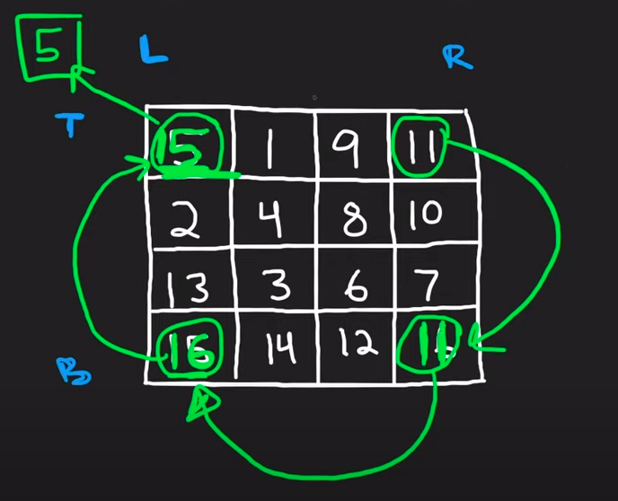

* Observe the pattern

| 1 | 2 | 3 |
|:-:|---|---|
| 4 | 5 | 6 |
| 7 | 8 | 9 |

=>

| 7 | 4 | 1 |
|:-:|---|---|
| 8 | 5 | 2 |
| 9 | 6 | 3 |

* Read the constraints
  * in place computation
  * we need to store previous value if we are going to overwrite. It's 90 degree rotate not traverse that we can swap
  * Try to think out of box

* Try to extend the box to store value and it can be easily done using list append operation.

start the loop in reverse and utilize the append operation.

we can start filling the table from column 4.

| 1 | 2 | 3 | 4 | . | . |
|---|---|---|---|:-:|---|
| 4 | 5 | 6 | 5 | . | . |
| 7 | 8 | 9 | . | . | . |

Approach 2: Reverse on Diagonal and then Reverse Left to Right
https://leetcode.com/problems/rotate-image/solutions/1037232/rotate-image/

Approach 3 : Rotate Groups of Four Cells

1. We are going to rotate four element in one go.
2. Store the topmost element in a temp variable and rotate in reverse order
