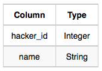
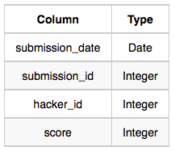
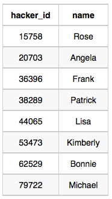
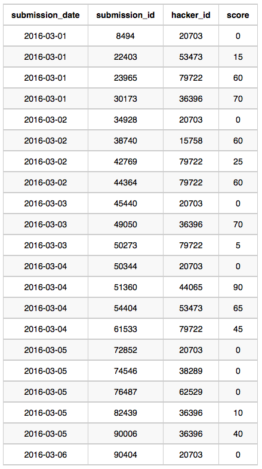

Julia conducted a  days of learning SQL contest. The start date of the contest was
March 01, 2016 and the end date was March 15, 2016.

Write a query to print total number of unique hackers who made at least  submission 
each day (starting on the first day of the contest), and find the hacker_id and name 
of the hacker who made maximum number of submissions each day. If more than one such 
hacker has a maximum number of submissions, print the lowest hacker_id. The query should 
print this information for each day of the contest, sorted by the date.


<hr>

**Input Format**

The following tables hold contest data:

- Hackers: The hacker_id is the id of the hacker, and name is the name of the hacker.




- Submissions: The submission_date is the date of the submission, 
submission_id is the id of the submission, hacker_id is the id 
of the hacker who made the submission, and score is the score of the submission.



**Sample Input**

For the following sample input, assume that the end date of the contest was March 06, 2016.

Hackers Table:




Submissions Table:




**Sample Output**

```
2016-03-01 4 20703 Angela
2016-03-02 2 79722 Michael
2016-03-03 2 20703 Angela
2016-03-04 2 20703 Angela
2016-03-05 1 36396 Frank
2016-03-06 1 20703 Angela
```

**Explanation**

On March 01, 2016 hackers 20703, 36396. 53473, and 79722 made submissions.
There are 4 unique hackers who
made at least one submission each day. As each hacker made one submission,
20703 is considered to be the hacker
who made maximum number of submissions on this day. The name of the hacker
is Angela.

On March 02, 2016 hackers 15758, 20703, and 79722 made submissions. Now 20703
and 79722 were the only ones
to submit every day, so there are 2 unique hackers who made at least one
submission each day. 79722 made 2
submissions, and name of the hacker is Michael.

On March 03, 2016 hackers 20703, 36396, and 79722 made submissions. Now 
20703 and 79722 were the only ones,
so there are 2 unique hackers who made at least one submission each day.
As each hacker made one submission so
20703 is considered to be the hacker who made maximum number of submissions
on this day. The name of the hacker
is Angela.

On March 04, 2016 hackers 20703, 44065, 53473, and 79722 made submissions.
Now 20703 and 79722 only
submitted each day, so there are 2 unique hackers who made at least one submission 
each day. As each hacker made
one submission so 20703 is considered to be the hacker who made maximum number
of submissions on this day. The
name of the hacker is Angela.

On March 05, 2016 hackers 20703, 36396, 38289 and 62529 made submissions.
Now 20703 only submitted each day.
so there is only 1 unique hacker who made at least one submission each day.
36396 made 2 submissions and name of
the hacker is Frank.

On March 06, 2016 only 20703 made submission, so there is only 1 unique 
hacker who made at least one submission
each day. 20703 made 1 submission and name of the hacker is Angela.