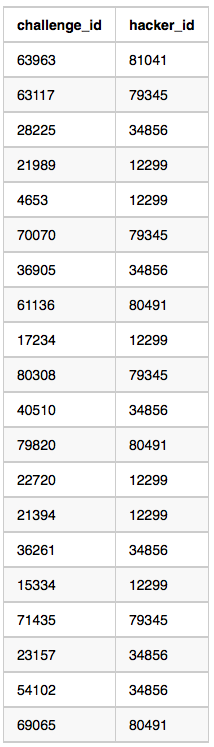

Julia asked her students to create some coding challenges. Write a query to 
print the hacker_id, name, and the total number of challenges created by each
student. Sort your results by the total number of challenges in descending order.
If more than one student created the same number of challenges, then sort the result
by hacker_id. If more than one student created the same number of challenges and the 
count is less than the maximum number of challenges created, then exclude those students
from the result.

**Input Format**

The following tables contain challenge data:

- Hackers: The hacker_id is the id of the hacker, and name is the name of the hacker.


- Challenges: The challenge_id is the id of the challenge, and hacker_id is the id of 
the student who created the challenge.


<hr>

**Sample Input 0**

Hackers Table:


Challenges Table:


**Sample Output 0**

```
21283 Angela 6
88255 Patrick 5
96196 Lisa 1
```

**Sample Input 1**

Hackers Table:


Challenges Table:



**Sample Output 1**


```
12299 Rose 6
34856 Angela 6
79345 Frank 4
80491 Patrick 3
81041 Lisa 1
```

**Explanation**


For Sample Case 0, we can get the following details:


Students 5077 and 62743 both created 4 challenges, but the maximum number of
challenges created is 6 so these students are excluded from the result.

For Sample Case 1, we can get the following details:


Students 12299 and 34856 both created 6 challenges. Because 6 is the maximum number of
challenges created, these students are included in the result.