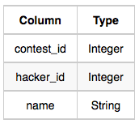
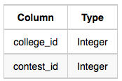
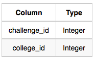
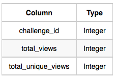
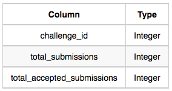
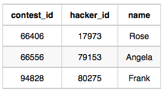
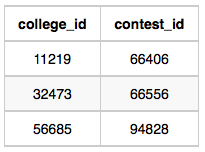
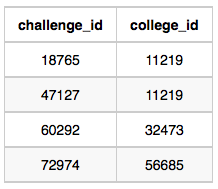
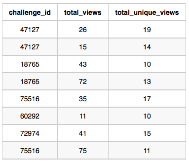
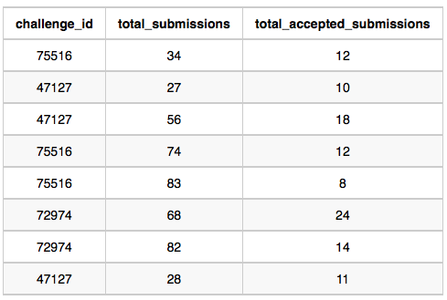

Samantha interviews many candidates from different colleges using coding
challenges and contests. Write a query to print the contest_id, hacker_id,
name, and the sums of total_submissions, total_accepted_submissions, total_views,
and total_unique_views for each contest sorted by contest_id. Exclude the contest
from the result if all four sums are .

**Note**: A specific contest can be used to screen candidates at more than one college, 
but each college only holds  screening contest.

<hr>

**Input Format**

The following tables hold interview data:

- Contests: The contest_id is the id of the contest, hacker_id is the id of 
the hacker who created the contest, and name is the name of the hacker.



- Colleges: The college_id is the id of the college, and contest_id is the 
id of the contest that Samantha used to screen the candidates.



- Challenges: The challenge_id is the id of the challenge that belongs to one
of the contests whose contest_id Samantha forgot, and college_id is the id of 
the college where the challenge was given to candidates.



- View_Stats: The challenge_id is the id of the challenge, total_views is the
number of times the challenge was viewed by candidates, and total_unique_views
is the number of times the challenge was viewed by unique candidates.



- Submission_Stats: The challenge_id is the id of the challenge,
total_submissions is the number of submissions for the challenge,
and total_accepted_submission is the number of submissions that achieved full scores.



<hr>

**Sample Input**

Contests Table:



Colleges Table:



Challenges Table:



View_Stats Table:



Submission_Stats Table:



**Sample Output**

```
66406 17973 Rose 111 39 156 56
66556 79153 Angela 0 0 11 10
94828 80275 Frank 150 38 41 15
```

**Explanation**

The contest 66406 is used in the college 11219. In this college 11219, challenges 18765 and 47127 are asked, so from
the view and submission stats:

- Sum of total submissions = 27+56 +28 = 111

- Sum of total accepted submissions = 10 +18+11 = 39

- Sum of total views = 43+ 72+26+ 15 = 156

Sum of total unique views = 10 +13+19+14 = 56
Similarly, we can find the sums for contests 66556 and 94828.