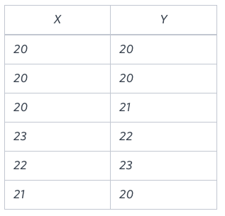

You are given a table, Functions, containing two columns: X and Y.


Two pairs (X1, Y1) and (X2, Y2) are said to be symmetric pairs if X1 = Y2 and X2 = Y1.

Write a query to output all such symmetric pairs in ascending order by the value of X. List the rows such that X1 ≤ Y1.

**Sample Input**




**Sample Output**

```
20 20
20 21
22 23
```
