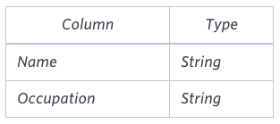

Generate the following two result sets:

1. Query an alphabetically ordered list of all names in OCCUPATIONS, 
immediately followed by the first letter of each profession as a 
parenthetical (i.e.: enclosed in parentheses). 
For example: AnActorName(A), ADoctorName(D), AProfessorName(P), and ASingerName(S).

2. Query the number of ocurrences of each occupation in OCCUPATIONS.
Sort the occurrences in ascending order, and output them in the following format:
3. 
```
There are a total of [occupation_count] [occupation]s.
```
where `[occupation_count]` is the number of occurrences
of an occupation in **OCCUPATIONS** and `[occupation]` is the
lowercase occupation name. If more than one Occupation 
has the same `[occupation_count]`, they should be ordered alphabetically.

**Note**: There will be at least two entries in the table for each type of occupation.

**Input Format**

The **OCCUPATIONS** table is described as follows:



Occupation will only contain one of the 
following values: **Doctor, Professor, Singer or Actor.**

**Sample Input**

An **OCCUPATIONS** table that contains the following records:


**Sample Output**

```
Ashely(P)
Christeen(P)
Jane(A)
Jenny(D)
Julia(A)
Ketty(P)
Maria(A)
Meera(S)
Priya(S)
Samantha(D)
There are a total of 2 doctors.
There are a total of 2 singers.
There are a total of 3 actors.
There are a total of 3 professors.
```

**Explanation**

The results of the first query are formatted to the problem 
description's specifications.
The results of the second query are ascendingly ordered first
by number of names corresponding to each profession (2 <= 2 <= 3 <= 3), and 
then alphabetically by profession (doctor <= singer, and actor <= professor).
