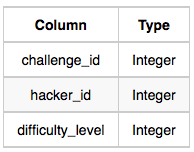
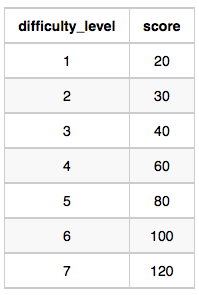
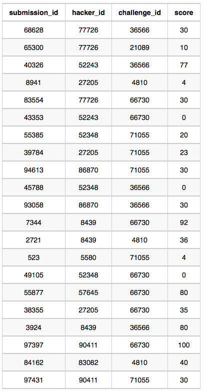

Julia just finished conducting a coding contest, and she needs your help assembling the leaderboard! Write a query to print the respective hacker_id and name of hackers who achieved full scores for more than one challenge. Order your output in descending order by the total number of challenges in which the hacker earned a full score. If more than one hacker received full scores in same number of challenges, then sort them by ascending hacker_id.

<hr>

**Input Format**

The following tables contain contest data:

- Hackers: The hacker_id is the id of the hacker, and name is the name of the hacker.


- Difficulty: The difficult_level is the level of difficulty of the challenge, and score is the score of the challenge for the difficulty level.


- Challenges: The challenge_id is the id of the challenge, the hacker_id is the id of the hacker who created the challenge, and difficulty_level is the level of difficulty of the challenge.



- Submissions: The submission_id is the id of the submission, hacker_id is the id of the hacker who made the submission, challenge_id is the id of the challenge that the submission belongs to, and score is the score of the submission.


<hr>
**Sample Input**

Hackers Table:


Difficulty Table:



Challenges Table:


Submissions Table:





**Sample Output**

```
90411 Joe
```

**Explanation**

Hacker 86870 got a score of 30 for challenge 71055 with a difficulty level of 2, so 86870 earned a full score for this challenge.

Hacker 90411 got a score of 30 for challenge 71055 with a difficulty level of 2, so 90411 earned a full score for this challenge.

Hacker 90411 got a score of 100 for challenge 66730 with a difficulty level of 6, so 90411 earned a full score for this challenge.

Only hacker 90411 managed to earn a full score for more than one challenge, so we print the their hacker_id and name as 2 space-separated values.


