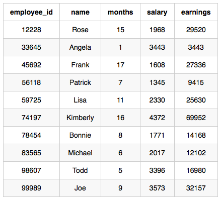

We define an employee's total earnings to be their monthly salary x months worked, and the maximum total earnings to be the maximum total earnings for any employee in the Employee table. Write a query to find the maximum total earnings for all employees as well as the total number of employees who have maximum total earnings. Then print these values as 2 space-separated integers.

**Input Format**

The **Employee** table containing employee data for a company is described as follows:


where employee_id is an employee's ID number, name is their name, months is the total number of months they've been working for the company, and salary is the their monthly salary.

**Sample Input**


**Sample Output**

```
69952 1
```

**Explanation**

The table and earnings data is depicted in the following diagram:



The maximum earnings value is 69952. The only employee with earnings = 69952
is Kimberly, so we print the maximum earnings value (69952) and a count 
of the number of employees who have earned $69952 (which is ) as two space-separated values.
